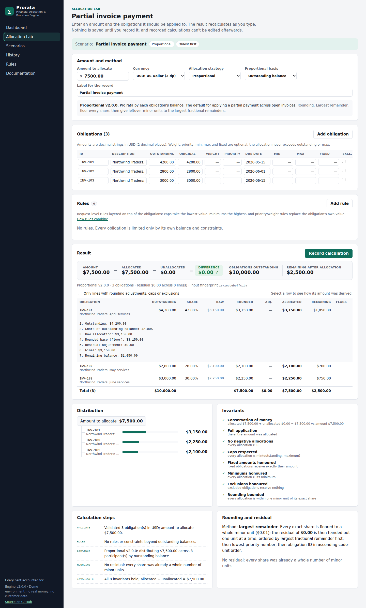
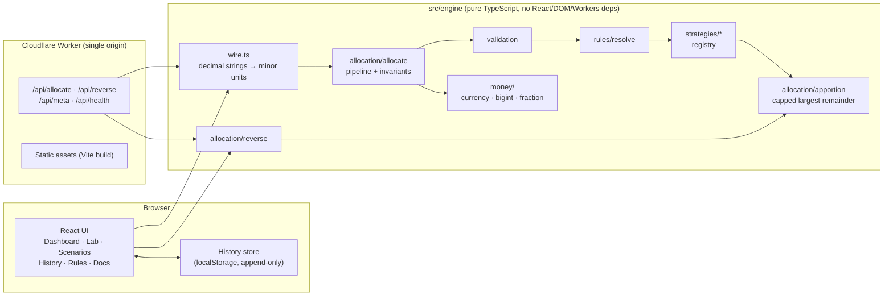
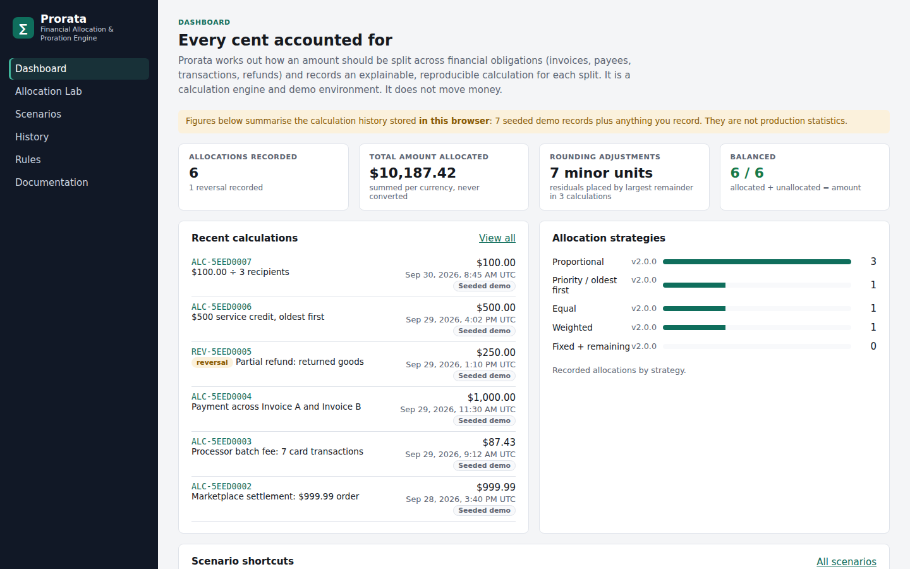
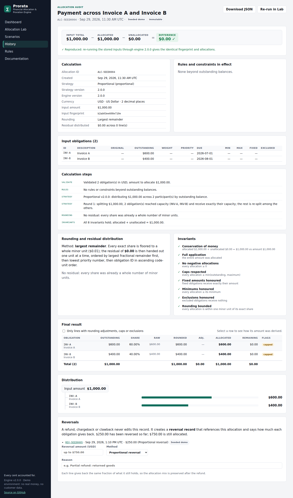
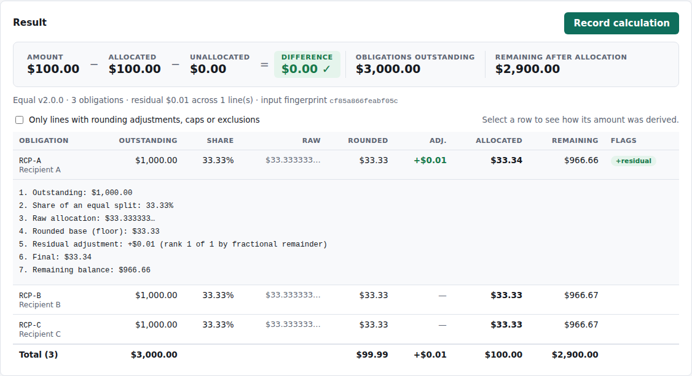
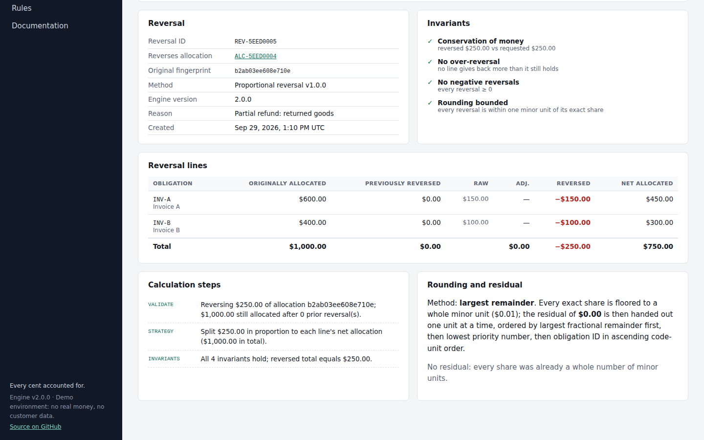
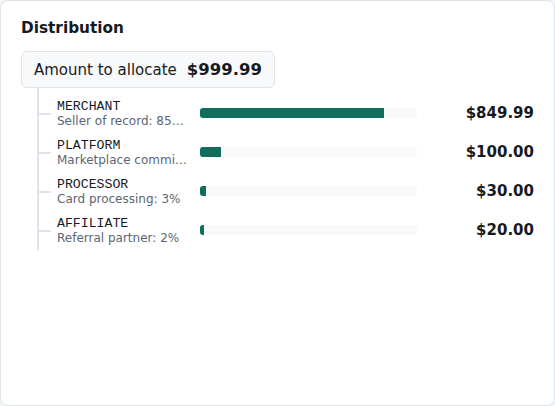
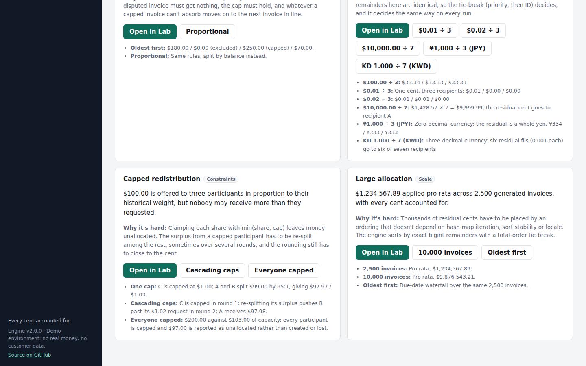
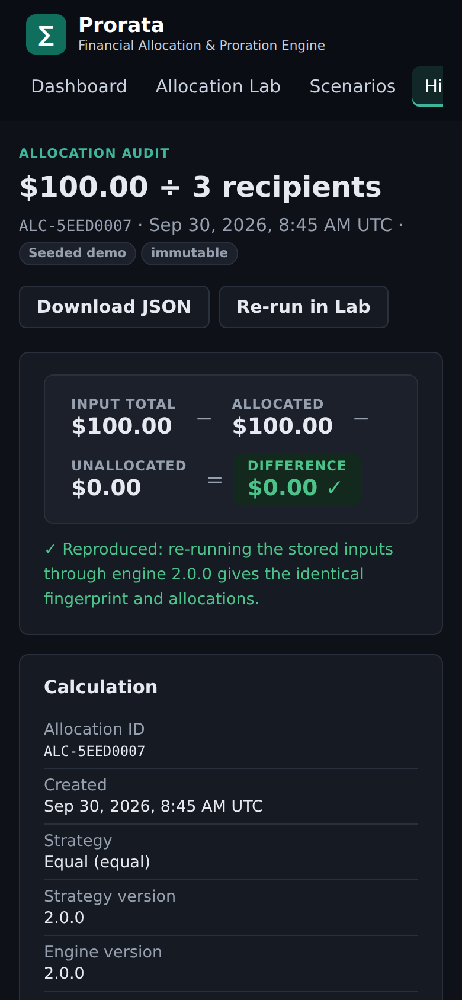

# Prorata

**A deterministic financial allocation and proration engine for payments, settlements, invoices, refunds, and revenue distribution.**

*Every cent accounted for.*

[](https://github.com/poker-kid-100717/allocation-proration-tool/actions/workflows/ci.yml)

Financial allocation looks simple until money doesn't divide evenly. Prorata allocates deterministically, preserves monetary invariants, respects constraints, and keeps an explainable history of every calculation.

It answers one question: **how should this amount be distributed?** Given an amount (a customer payment, a settlement, a batch fee, a refund, a credit) and the obligations it applies to, it returns an exact split. It also explains every number in that split and can reproduce it later from the stored inputs.



> Prorata is a calculation engine and demonstration environment. It does not move money, connect to banks or processors, or hold customer data. All names and amounts in the app are fictional.

---

## Contents

- [The problem](#the-problem)
- [Why financial allocation is harder than it looks](#why-financial-allocation-is-harder-than-it-looks)
- [Features](#features)
- [Financial correctness](#financial-correctness)
- [Allocation algorithms](#allocation-algorithms)
- [Rounding strategy](#rounding-strategy)
- [Examples](#examples)
- [Architecture](#architecture)
- [Screenshots](#screenshots)
- [Testing](#testing)
- [Edge cases](#edge-cases)
- [Local development](#local-development)
- [Deployment](#deployment)
- [HTTP API](#http-api)
- [Technical decisions](#technical-decisions)

## The problem

Financial systems regularly receive one amount that has to be spread across several obligations:

| Situation | Amount | Obligations |
| --- | --- | --- |
| Partial payment | Customer remits $7,500 | Three open invoices totalling $10,000 |
| Marketplace settlement | $1,000 order | Merchant, platform, processor, affiliate |
| Fee allocation | One $87.43 processor fee | Seven card transactions in the batch |
| Refund | $250 refunded | The invoices the original payment settled |
| Credit | $500 service credit | Outstanding invoices, subject to policy |
| Revenue share | Partner payout | Partners at 50% / 30% / 20% |

The flagship case: a customer owes $4,200 + $2,800 + $3,000 = $10,000 and pays $7,500. Pro rata gives each invoice 75% of its balance:

| Invoice | Outstanding | Share | Allocated | Remaining |
| --- | ---: | ---: | ---: | ---: |
| INV-101 | $4,200.00 | 42.00% | $3,150.00 | $1,050.00 |
| INV-102 | $2,800.00 | 28.00% | $2,100.00 | $700.00 |
| INV-103 | $3,000.00 | 30.00% | $2,250.00 | $750.00 |
| **Total** | **$10,000.00** | | **$7,500.00** | **$2,500.00** |

`SUM(allocations) == amount`, with a difference of $0.00, on every calculation.

## Why financial allocation is harder than it looks

**Rounding.** $100 ÷ 3 is $33.333…, and money can't hold a third of a cent. Rounding each share on its own gives $33.33 × 3 = $99.99, so a cent disappears. Round-half-up can just as easily create a cent. Either way the ledger no longer balances.

**Residuals.** The cent has to go somewhere, and the choice has to be defensible. "Always the first line" or "always the largest" biases one party every time. The rule must be documented, and it must give the same answer tomorrow, on another server, with the obligations in a different order.

**Precision.** Not every currency has cents. JPY has no minor unit and KWD has three decimal places. Binary floating point can't represent $0.10 exactly (`0.1 + 0.2 !== 0.3`), and above 2⁵³ it can't represent consecutive integers at all. Precision belongs to the currency, and arithmetic has to be exact.

**Caps.** An obligation can't receive more than it owes. Clamping with `min(share, balance)` silently leaves money unallocated. The surplus has to be re-split among the others, and that can push another obligation over its cap, so redistribution runs in rounds.

**Priorities.** Oldest-first, tax-first, or fee-first ordering changes which receivables stay open. Equal priorities still need a total order, or the result depends on sort stability.

**Partial payments and over-payments.** When the amount is less than what's owed, somebody is short. When it's more, the excess has to be reported as unapplied, not created or dropped.

**Reversals.** A refund can't edit the original allocation, because that is a financial record. It needs its own calculation that references the original, and a series of partial refunds must never reverse more than a line received.

**Auditability and determinism.** An auditor, a customer or a support engineer will eventually ask "why is this $2,100.00?" The answer has to be reproducible from the stored inputs, and the same inputs under the same algorithm version must always produce the same output.

## Features

- **Allocation Lab** (flagship): enter an amount, currency, strategy, obligations and rules. The result recalculates as you type, with a balance check, per-line explanations, a distribution tree, calculation steps, rounding detail and invariant checks.
- **Five strategies**: proportional (by outstanding or original amount), priority / oldest-first, equal, weighted, and fixed + remaining. Caps are enforced by the engine for every strategy.
- **Rules**: cap, minimum, fixed, exclude, priority and weight, layered over per-obligation constraints and recorded with their source.
- **Reversals**: proportional or reverse-priority (last applied, first reversed), aware of earlier partial reversals and linked to the original record.
- **Immutable history**: every recorded calculation stores inputs, outputs, engine and strategy versions, and an input fingerprint. The audit view re-runs the stored inputs and confirms the result reproduces.
- **Eight built-in scenarios**: partial invoice payment, marketplace settlement, processor fee allocation, refund allocation, credit allocation, rounding edge cases (including JPY and KWD), capped redistribution, and a 2,500 / 10,000-obligation run.
- **Multi-currency precision**: USD, EUR, GBP, CAD (2 dp), JPY, KRW (0 dp), KWD, BHD (3 dp).
- **HTTP API** on Cloudflare Workers: the same engine as the UI, with money as decimal strings only.

## Financial correctness

Money is always an integer number of the currency's minor unit, held as a `bigint`. There is no floating point on the calculation path, and no 2⁵³ ceiling. Unrounded shares are exact fractions (`{ num, den }` bigints), so the audit trail can show `$33.333333…` without a float ever holding it. Input amounts are decimal strings. The parser rejects more decimal places than the currency supports (`"10.001"` in USD, `"100.5"` in JPY) instead of rounding user input.

Every result is checked against these invariants before it's returned. A failure throws `InvariantViolation`; the engine never returns a wrong amount:

| Invariant | Statement |
| --- | --- |
| Conservation of money | `allocated + unallocated == amount`, exactly |
| Full application | `unallocated > 0` only when every eligible obligation is at capacity |
| Non-negative | `allocation[i] >= 0` |
| Caps respected | `allocation[i] <= min(outstanding[i], maximum[i])` |
| Fixed amounts honoured | `allocation[i] == fixed[i]` |
| Minimums honoured | `allocation[i] >= minimum[i]` |
| Exclusions honoured | excluded obligations receive `0` |
| Rounding bounded | every allocation is within one minor unit of its exact share |

Reversals have their own set: the reversed total equals the refund, no line gives back more than it still holds, and rounding stays bounded.

**Determinism.** The same request, rules and strategy version always produce a deep-equal result, down to the explanation strings. The output doesn't depend on obligation order (a tested property), `Map` iteration, `Array.prototype.sort` stability, the clock, or the locale. IDs are compared by code unit, never `localeCompare`, and one test booby-traps `localeCompare` to prove the engine never calls it.

**Versioning.** Every result records `engineVersion` and the strategy's `version`, plus a 64-bit FNV-1a `inputFingerprint` of the canonical request. A change that could alter the output for an existing input requires a version bump, so history stays reproducible against the version that produced it.

## Allocation algorithms

All strategies implement one interface ([`src/engine/strategies/types.ts`](src/engine/strategies/types.ts)) and see only the pool left after fixed amounts and minimums. Validation, rules, caps, invariants and the audit trail belong to the engine, so a new strategy can't bypass them.

| Strategy | Id | Behaviour |
| --- | --- | --- |
| Proportional | `proportional` | Pro rata by outstanding balance (default) or original amount |
| Priority / oldest first | `priority` | Fills obligations in full in priority order, then oldest due date, then ID. No rounding needed |
| Equal | `equal` | Same share for everyone; a capped participant's surplus is re-split |
| Weighted | `weighted` | By explicit weights or percentages; weights are normalised, with a warning when "percentages" don't total 100 |
| Fixed + remaining | `fixed-remainder` | Fixed amounts off the top, remainder by weight (or balance if no weights) |

The engine pipeline ([`src/engine/allocation/allocate.ts`](src/engine/allocation/allocate.ts)):

```
validate → resolve rules → fixed amounts → minimums → strategy (capped split) → residual rounding → invariant checks
```

**Capped redistribution** ([`apportion.ts`](src/engine/allocation/apportion.ts)). A participant whose proportional share meets or exceeds its capacity gets exactly its capacity, and the rest is re-split among the others, repeating until nobody exceeds a cap. Capping one participant can only raise everyone else's share, so the engine sorts participants by capacity ÷ weight once and caps along that order. That makes it O(n log n) rather than the naive O(n²), while still recording the rounds for the audit trail. This is the algorithm from this repository's original investor-proration tool, rebuilt on exact integer arithmetic; its original examples are kept as tests, now in cents.

**Rules** ([`src/engine/rules/resolve.ts`](src/engine/rules/resolve.ts)) combine without depending on the order they're written in: caps take the lowest value, minimums the highest, and request rules replace an obligation's priority or weight. Two different fixed amounts for one obligation are an error, not a silent choice.

## Rounding strategy

Prorata uses the **largest remainder method** (Hamilton's method):

1. Compute each share exactly: `pool × weight ÷ totalWeight`, as a fraction of minor units.
2. Floor each share to a whole minor unit.
3. The residual `pool − Σ floors` is always smaller than the number of participants.
4. Give one unit each to the participants with the largest fractional remainders.

**Tie-break** (a total order, so the result is always deterministic):

1. largest fractional remainder first
2. then lowest priority number
3. then obligation ID in ascending code-unit order

**Why this method:** no allocation ends up a full minor unit away from its exact share, it's the standard apportionment method, and it's easy to explain line by line. "Put the residual on the largest line" is simpler but biases one party every time. Banker's rounding on each share doesn't guarantee the total at all.

A residual unit can't break a cap: a share strictly below its cap that has a fractional remainder is at least one unit below the cap.

```
$100.00 ÷ 3
RCP-A  raw $33.333333…  floor $33.33  +$0.01 (rank 1)  → $33.34
RCP-B  raw $33.333333…  floor $33.33                   → $33.33
RCP-C  raw $33.333333…  floor $33.33                   → $33.33
                        Σ    $99.99   +$0.01             $100.00
```

The remainders tie, so priority and then ID decide. That's why the cent goes to `RCP-A`, and why it goes there on every run.

## Examples

| Scenario | Input | Result |
| --- | --- | --- |
| Partial payment, proportional | $7,500 → $4,200 / $2,800 / $3,000 | $3,150.00 / $2,100.00 / $2,250.00 |
| Partial payment, oldest first | same | $4,200.00 / $2,800.00 / $500.00 |
| Marketplace settlement | $1,000 at 85 / 10 / 3 / 2 | $850.00 / $100.00 / $30.00 / $20.00 |
| Settlement, odd total | $999.99 at 85 / 10 / 3 / 2 | $849.99 / $100.00 / $30.00 / $20.00 (3 residual cents) |
| Fixed processor fee | $1,000, processor fixed $30, rest 85 / 10 / 2 | $850.00 / $100.00 / $30.00 / $20.00 |
| Credit with rules | $500 oldest-first; one invoice disputed, $250 per-invoice cap | $180.00 / $0.00 (excluded) / $250.00 (capped) / $70.00 |
| Refund reversal | $250 refund of $600 / $400 | −$150.00 / −$100.00 (proportional) or −$0 / −$250 (reverse priority) |
| Zero-decimal currency | ¥1,000 ÷ 3 | ¥334 / ¥333 / ¥333 |
| Three-decimal currency | KD 1.000 ÷ 7 | 0.143 × 6, 0.142 × 1 |
| Everyone capped | $200 against $103 of capacity | $103 allocated, $97 reported as unallocated |

Each of these is a built-in scenario and an automated test.

## Architecture



```
src/
  engine/                 # the financial engine: pure, framework-free, fully unit-tested
    domain.ts             # Obligation, AllocationRequest/Result/Line, AllocationRule, RoundingAdjustment, …
    money/                # currency metadata, bigint Money parsing/formatting, exact fractions, weights
    validation/           # structural validation with paths and messages
    rules/                # folds obligation constraints + request rules into effective constraints
    strategies/           # strategy interface, five strategies, registry
    allocation/           # apportion (capped largest remainder), allocate pipeline, reverse, fingerprint
    wire.ts               # JSON/form wire format ↔ engine types
    records.ts            # immutable calculation records, storage encoding
  scenarios/catalog.ts    # built-in scenarios and a seeded obligation generator
  app/                    # React UI: router, history store, components, feature screens
worker/index.ts           # Cloudflare Worker: JSON API + static assets
test/                     # unit, property, torture, scenario, performance and API tests
bench/                    # allocation benchmark (npm run bench)
```

The UI runs the engine in the browser, so the Lab recalculates on every keystroke without a round trip. The Worker exposes the same engine as an API. There is exactly one implementation of the maths.

## Screenshots

All screenshots come from the current build.

| | |
| --- | --- |
|  **Dashboard**: history summary, clearly labelled as seeded demo data |  **Audit**: balance check, reproducibility check, inputs, rules, steps, rounding, invariants, final result |
|  **Rounding**: $100 ÷ 3 with raw, floor, residual adjustment and total |  **Reversal record** linked to the original allocation |
|  **Distribution tree** for a $999.99 marketplace settlement |  **Scenarios** |



## Testing

```bash
npm test          # 573 tests, ~2 s
npm run bench     # allocation timings for 100 / 1,000 / 10,000 obligations
```

| File | Tests | What it covers |
| --- | ---: | --- |
| [`test/engine/properties.test.ts`](test/engine/properties.test.ts) | 404 | 400 seeded random requests across all strategies, both currencies, caps, exclusions and fixed amounts, each checked for conservation, caps, non-negativity, fixed/excluded handling and bounded residuals; determinism; order independence; locale independence |
| [`test/engine/validation.test.ts`](test/engine/validation.test.ts) | 33 | Every input error (negative, NaN, Infinity, JSON-number money, bad currency or precision, duplicate IDs, zero weights, impossible dates, unknown rules) and constraint conflicts; rule combination |
| [`test/engine/money.test.ts`](test/engine/money.test.ts) | 28 | Exact parsing and formatting, `0.1 + 0.2`, amounts beyond 2⁵³, every currency round-trip, FNV-1a test vectors |
| [`test/engine/torture.test.ts`](test/engine/torture.test.ts) | 18 | The edge-case list below |
| [`test/engine/strategies.test.ts`](test/engine/strategies.test.ts) | 17 | Each strategy's behaviour and explanations; caps enforced under every strategy |
| [`test/engine/apportion.test.ts`](test/engine/apportion.test.ts) | 12 | The core algorithm, including the original repository's examples in cents and cascading cap rounds |
| [`test/engine/reversal.test.ts`](test/engine/reversal.test.ts) | 7 | Proportional and reverse-priority reversals, prior reversals, over-reversal rejection, original left unchanged |
| [`test/engine/records.test.ts`](test/engine/records.test.ts) | 6 | Immutability (frozen records), exact bigint storage round-trip, wire round-trip |
| [`test/scenarios.test.ts`](test/scenarios.test.ts) | 34 | Every scenario and variant runs, conserves money and produces its documented numbers |
| [`test/worker.test.ts`](test/worker.test.ts) | 10 | API responses, identical output for identical requests, 400 / 405 / 413 / 422 handling |
| [`test/performance.test.ts`](test/performance.test.ts) | 4 | 10,000 obligations per strategy and a 10,000-obligation cascade of cap rounds, within generous time limits |

Property tests use a small seeded PRNG rather than a property-testing library, so a failing case names its seed and replays exactly, with no extra dependency.

**Performance** (`npm run bench`; median per `allocate()` call, including validation, full audit trail and invariant checks, on a 4-vCPU 2.1 GHz Xeon container):

| Obligations | proportional | equal | priority |
| ---: | ---: | ---: | ---: |
| 100 | 1.9 ms | 1.3 ms | 2.0 ms |
| 1,000 | 16.9 ms | 11.0 ms | 11.8 ms |
| 10,000 | 153.7 ms | 155.4 ms | 114.9 ms |

Numbers vary by machine. Run the benchmark yourself rather than taking these as a claim.

## Edge cases

All covered by [`torture.test.ts`](test/engine/torture.test.ts), [`apportion.test.ts`](test/engine/apportion.test.ts) and the scenario tests:

- $0.01 ÷ 3 → $0.01 / $0.00 / $0.00
- $0.02 ÷ 3 → $0.01 / $0.01 / $0.00
- $100 ÷ 3 → $33.34 / $33.33 / $33.33, never $99.99
- $10,000 ÷ 7 → one residual cent
- $0.07 across 1,000 recipients → exactly seven get a cent, chosen by ID
- $10.01 across 1,000 → exactly one recipient gets the extra cent
- Identical fractional remainders → priority, then ID
- $123,456,789,012,345,678.91 ÷ 3 (far beyond `Number.MAX_SAFE_INTEGER` cents), exact
- ¥1,000 ÷ 3 (zero-decimal) and KD 1.000 ÷ 7 (three-decimal)
- An obligation smaller than its calculated share → capped, surplus re-split
- Cascading caps over several rounds
- All obligations capped / amount greater than total outstanding → excess reported as unallocated
- Zero amount, zero balances, excluded obligations
- Minimums allocated before the split; fixed amounts off the top
- Fixed + minimum amounts exceeding the payment → rejected with the exact shortfall

## Local development

Requires Node 22 or newer.

```bash
npm install
npm run dev           # UI with hot reload at http://localhost:5173 (the engine runs in the browser)
npm run dev:worker    # build, then UI + API on the Workers runtime at http://localhost:8787
npm run check         # typecheck + lint + tests + production build (what CI runs)
```

With `npm run dev`, Vite proxies `/api` to `wrangler dev` on port 8787 if you run that alongside it.

## Deployment

One Cloudflare Worker serves both the static UI ([Workers Static Assets](https://developers.cloudflare.com/workers/static-assets/)) and the `/api/*` routes, so hosting is a single `wrangler deploy` on the free tier.

CI ([`.github/workflows/ci.yml`](.github/workflows/ci.yml)) runs install → `npm audit` → typecheck → lint → tests → build on every push and pull request. On `main` it deploys and then smoke-tests the live URL: health, a `$100 ÷ 3` allocation that must return `33.34 / 33.33 / 33.33` with a zero difference, and the SPA shell.

The deploy job needs two repository secrets. Until they exist it skips with a notice instead of failing:

| Secret | Where to get it |
| --- | --- |
| `CLOUDFLARE_API_TOKEN` | Cloudflare dashboard → My Profile → API Tokens → "Edit Cloudflare Workers" template |
| `CLOUDFLARE_ACCOUNT_ID` | Cloudflare dashboard → Workers & Pages → Account ID |

To deploy by hand: `npx wrangler login`, then `npm run deploy`.

## HTTP API

Money is always a decimal string in major units. JSON numbers are rejected, because once parsed they are binary floats.

```http
POST /api/allocate
Content-Type: application/json

{
  "amount": "7500.00",
  "currency": "USD",
  "strategy": "proportional",
  "obligations": [
    { "id": "INV-101", "outstanding": "4200.00", "dueDate": "2026-05-15" },
    { "id": "INV-102", "outstanding": "2800.00" },
    { "id": "INV-103", "outstanding": "3000.00", "max": "2000.00" }
  ],
  "rules": [{ "kind": "exclude", "obligationId": "INV-102", "label": "Disputed" }]
}
```

The response has a `summary` (amount, allocated, unallocated, difference, allocations by ID) and the full `result`: lines with raw fractions, rounding adjustments, applied rules, steps, invariants and fingerprint. Bigints are serialised as strings.

| Endpoint | Purpose |
| --- | --- |
| `POST /api/allocate` | Allocate an amount |
| `POST /api/reverse` | `{ original, amount, method }`. Stateless: the Worker recomputes the original from its request rather than trusting a client-supplied result |
| `GET /api/meta` | Engine version, strategies with versions, reversal methods, currencies |
| `GET /api/health` | Liveness |

Invalid input returns `422` with every issue and its path (for example `obligations[1].outstanding: USD has 2 decimal places; "1.001" has 3`). Bodies over 4 MB get `413`, and the API accepts up to 10,000 obligations per request.

## Technical decisions

- **`bigint` minor units, not a decimal library.** Allocation needs only integer addition, multiplication, floor division and comparison, and `bigint` does all of that exactly with no dependency. Exact fractions cover the one place a non-integer appears: the unrounded share.
- **Largest remainder over per-line rounding.** It is the only common scheme that guarantees the total and keeps every line within one unit of its exact share. The tie-break is a total order, so ties are never left to sort stability.
- **Caps are an engine invariant, not a strategy.** Every strategy is capped. A "capped allocation" option you could forget to choose would be a bug waiting to happen.
- **Reject, don't correct.** Too many decimal places, contradictory rules, or fixed amounts that exceed the payment are errors that name the field. Silently rounding input or dropping a constraint is how ledgers drift.
- **Unallocated is a first-class output.** When capacity runs out, the excess is reported rather than forced onto someone or dropped.
- **Immutable, reproducible records.** Records are deep-frozen and append-only. Each one stores its inputs plus the engine and strategy versions, and the audit view re-runs those inputs to show the result still reproduces.
- **One engine, two hosts.** The same pure module runs in the browser and in the Worker. The Worker's reversal endpoint recomputes the original allocation instead of accepting one from the client.
- **FNV-1a fingerprint, labelled as such.** It identifies identical inputs cheaply and synchronously. It is not presented as a cryptographic integrity control.
- **Small, deliberate dependencies.** React, Vite, Vitest, Wrangler and oxlint. oxlint is used because typescript-eslint does not yet support TypeScript 7. No UI kit, router, state library, decimal library or property-testing library.
- **Hash routing and localStorage history.** Fitting for a single-origin demo with no accounts. History is labelled as per-browser demo state, not a system of record.

### Scope

Prorata decides **how an amount should be distributed**. It deliberately doesn't trace what happened to money afterwards: ledger posting, reconciliation and transaction observability belong to a separate companion project (LedgerLens). The boundary keeps this engine small, pure and easy to verify.
